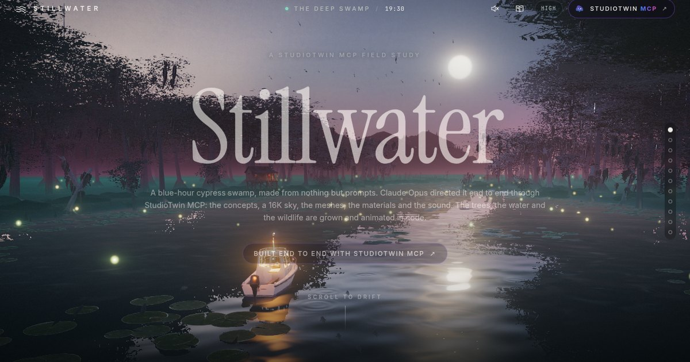

# Stillwater

**A blue-hour cypress swamp, made from nothing but prompts.**

An AI agent (Claude Opus) built this world end to end through **[StudioTwin MCP](https://studiotwin.ai/mcp)**: the concept art, a 16K sky, every mesh, the materials, the rigged heron and the sound. Scroll the story of how it was made, then take the helm and steer the boat yourself.

**[▶ Play it live](https://stillwater-studiotwin.surge.sh/)** · **[Read the production journal](https://stillwater-studiotwin.surge.sh/journal.html)**



## Build your own

Give your agent the same toolbox:

```bash
npx skills add realtwin/studiotwin-mcp-skill
```

Then connect StudioTwin MCP at **[studiotwin.ai/mcp](https://studiotwin.ai/mcp)** and ask for a world. Works with Claude Code, Cursor, Codex, Gemini and any agent that supports skills. Every account starts with free monthly credits.

## What StudioTwin made

| Piece | StudioTwin function |
|---|---|
| Key art and art direction | ConceptLab generate → `edit` on the same Concept |
| 360° sky, 16K HDR lighting | `text-to-environment-map` → ConceptLab `edit` → `environment-map-upscale-cpu` |
| Boat, heron, cabins, shack, sign, lanterns, fish, ridges, a rubber duck | ConceptLab concept → `tripo-image-to-3d-mesh` |
| Heron skeleton (76 bones) | `tripo-auto-rig` |
| Mud, bark, teak deck, lily pads | `text-to-material`, `image-to-material` |
| Foliage and Spanish-moss cards | ConceptLab concepts and edits, keyed to alpha |
| Frogs, outboard, heron croak, creaking sign, splashes, wings | `text-to-sound-effect` |

57 generations, 1,825 credits, about **$36.50** at StudioTwin's published rate. The full call ledger is in the [journal](https://stillwater-studiotwin.surge.sh/journal.html).

The forest itself is grown in code: a species-driven recursive grower dressed with StudioTwin bark and foliage, with three levels of detail per tree.

## Tech

- **three.js r186 on WebGPURenderer** (automatic WebGL2 fallback), all shading and post written as **TSL node materials**.
- Planar-reflection water with ripples, wake, moon glitter and a crisp mirror around the boat; height fog; fireflies; agent-driven fish; boids birds.
- Post: 4× MSAA, a soft anamorphic-style lens (streaks, halation, de-speckle), bloom, split-tone grade, SMAA.
- Scroll-driven story camera (Lenis + critically damped smoothing) that hands off to a chase cam for play mode.
- Mobile and Max quality tiers, adaptive resolution, staged loader that tracks download, build, shader compile and first frame.

## Run it locally

```bash
npm install
npm run dev        # http://localhost:5173
npm run build      # static site in dist/
```

Needs Node 20+. Any static host works for `dist/`.

### Handy URL flags

| Flag | Effect |
|---|---|
| `?fps` | FPS / frame-time / draw-call widget |
| `?nolens` | turn the lens post effect off |
| `?nopost` | raw scene, no post chain |
| `?mist=1` | low mist sheets over the water |
| `?t=6.5` | freeze the story at a chapter (0–10) |
| `?hide=trees\|lilies\|fish` | hide a layer |
| `?prof` | per-subsystem CPU timing and triangle inventory in `window.__prof` |

`treelab.html` is a standalone viewer for the procedural trees.

## Project layout

```
index.html        the scrollytelling site (11 chapters)
journal.html      production journal + StudioTwin call ledger
src/main.js       loader, story camera, play mode, render loop
src/world.js      terrain, water, lilies, fireflies
src/worldNodes.js TSL sky, water, fireflies, lily and boat materials
src/trees.js      procedural tree grower; forest.js = instanced LOD forest
src/props.js      cabins, sign, lanterns, fish; birds.js = swifts and waders
src/story.js      authored camera path
public/           StudioTwin outputs: models (Draco glb), textures, sky, sound
```

---

Made with **[StudioTwin MCP](https://studiotwin.ai/mcp)** by RealTwin.
